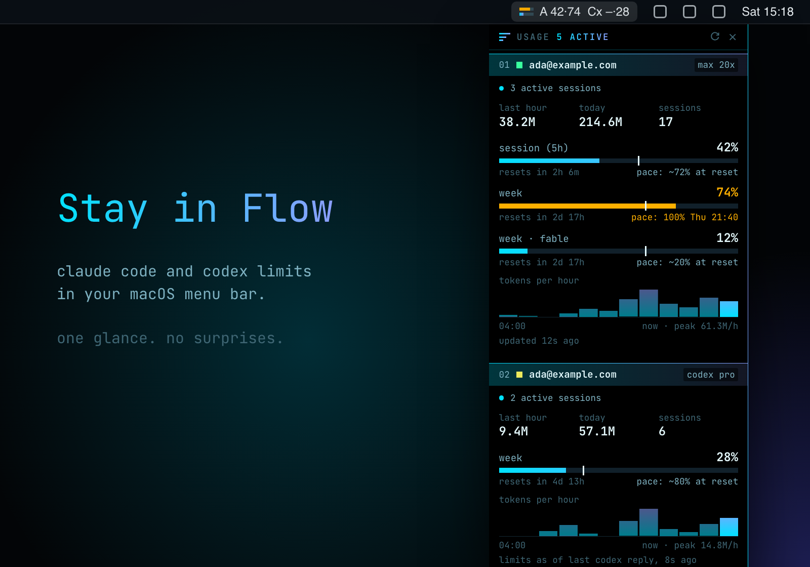

<p align="center">
  
</p>

<h1 align="center">Usage Flow</h1>

<p align="center">
  <b>Claude Code and Codex limits at a glance, in your menu bar.</b><br>
  No dashboard to open, no <code>/usage</code> to type, no surprise at 100%. Look up and stay in flow.
</p>

<p align="center">
  <a href="https://github.com/onflow-studio/usage-flow/releases/latest"><b>Download for macOS (Apple Silicon)</b></a>
  ·
  <a href="#build-it-yourself">Build from source</a>
</p>

---

## Why

Limits only show up when you hit them. The session window runs out in the middle of a refactor, the weekly one two days before it resets, and the only way to see either coming is to stop and ask. Usage Flow keeps every account's limits where a glance finds them: a small gauge in the menu bar, and a panel with the detail when you want it.

## What you get

- **Every account, side by side.** Each Claude Code login on your Mac (`~/.claude` and any `~/.claude-*` config folder) plus Codex, found on their own.
- **Limits with a pace.** Session and weekly windows as bars, with a tick for how much of the window has passed and a projection: `pace: ~72% at reset`, or the time you would hit 100%.
- **An icon that shows what's on.** One bar per account in the menu bar, filled as far as its fullest limit. It turns amber at 70% and red at 90%.
- **What you are burning.** Tokens in the last hour and today, sessions running right now, and a 12-hour chart per account, read from local transcripts.
- **A heads-up before the wall.** A notification at 80, 90 and 100% of a limit, and when a session or week resets.
- **Fits where you put it.** The panel docks to the edge of a display, full height, and sizes its content to the room it has. Drag it to another display and it settles there.
- **Settings in the menu.** Click the gauge for the panel, menu bar figures, alerts, always on top, all desktops and open at login.
- **Quiet by design.** No account, no telemetry, no Dock icon. It only talks to the services you already use.

## Install

1. Download `Usage.Flow-*-arm64-mac.zip` from the [latest release](https://github.com/onflow-studio/usage-flow/releases/latest) and unzip it.
2. Move **Usage Flow.app** to `/Applications`.
3. The app isn't notarized by Apple, so macOS blocks the first launch. Clear the download flag once:

   ```sh
   xattr -dr com.apple.quarantine "/Applications/Usage Flow.app"
   ```

4. Open it. The gauge appears in your menu bar and the panel on the left edge of your screen. It opens at login from then on; click the gauge to turn that off.

## Use

| Do this | To |
| --- | --- |
| Click the gauge | Open the menu |
| **Show Panel** / **Hide Panel** | Show or hide the panel |
| Drag the panel's top row | Move it, also to another display |
| ↻ in the panel, or **Refresh Now** | Fetch limits now instead of waiting 10 minutes |
| ✕ in the panel | Hide it. **Show Panel** brings it back |
| **Usage in Menu Bar** | Show the figures beside the gauge (`session·week` per account). Off to start with |
| **Alerts at 80, 90 and 100%** | Turn notifications on or off |
| **Always on Top** / **Show on All Desktops** | Keep the panel above other windows, and on every Space |
| **Move to Next Display** | Dock the panel on the next display |
| **Open at Login** / **Quit Usage Flow** | The usual |

## How it works

Usage Flow is a small native app written in Rust with [egui](https://github.com/emilk/egui). It has no server and no account of its own.

Claude Code limits come from Anthropic's usage endpoint, asked every 10 minutes with the login Claude Code already keeps in your Keychain. The token is read fresh each time and never stored or sent anywhere else. Codex limits come from the snapshots Codex writes into its own session logs, so they are as fresh as its last reply. Token counts, sessions and the hourly chart are read from the transcripts both tools keep on your Mac, every 10 seconds.

Settings and the last reading are saved to `~/Library/Application Support/Usage Flow/`. That folder is the only thing it stores, and it never leaves your Mac.

## Build it yourself

Needs Rust 1.85+ and the Xcode command line tools.

```sh
git clone https://github.com/onflow-studio/usage-flow.git
cd usage-flow
make start          # build and launch from source
make install-app    # package and copy to /Applications/Usage Flow.app
make release        # package a distributable zip into release/
```

Colors, type and spacing come from [`DESIGN.md`](DESIGN.md) and live in [`src/theme.rs`](src/theme.rs).

## Origin

Usage Flow started as claude-usage, a personal monitor for a couple of Claude Code accounts. Codex joined, the panel stayed open all day next to [Radio Flow](https://github.com/onflow-studio/radio-flow), and it took the same look to sit beside it.

## License

[MIT](LICENSE). JetBrains Mono is bundled under the [SIL Open Font License](assets/fonts/OFL.txt).
